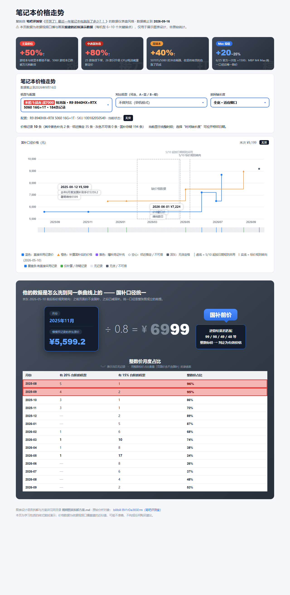

# price-history-analysis

商品历史价格走势分析 skill —— 笔吧评测室方法。把「这东西现在是不是高位」量化成一条**可溯源、口径统一**的阶梯价格曲线。

核心纪律：**每条价格必须可溯源，口径必须统一，空窗必须诚实。**

## 它能回答什么

| 用户问题 | 是否触发 |
|---|---|
| "这个型号涨了多少""价格走势""历史价格" | ✅ |
| "现在买是不是高位""该不该再等等" | ✅ |
| "画个价格曲线""价格复盘""年度价格对比" | ✅ |
| "解析这个价格分析视频" | ✅（视频证据法模块） |
| "现在多少钱""哪买便宜""有什么优惠" | ❌ 用 `shopping-deal-research` |

## 工作流

1. **确认需求** —— 具体型号（含配置）、时间范围（默认回溯 12 个月）、地区国补规则
2. **取数：锚点而非全序列** —— 慢慢买历史曲线（主源）/ SMZDM 好价帖 / IT之家官网 / 京东页面价
3. **口径统一**（本技能核心）—— 全部折算成"国补后到手价"
   - 判定标价规则转向日（抽查跨日期前后价格，找"精准下跌 = 补贴率"那天）
   - 整数价逆算 `记录价 ÷ (1−补贴率)`，命中常见尾数（99/98/49/48/999/4999）判为未含国补
   - 邻近推定 ±8%（15 天窗口，推定点不得再作新参照）
   - 爆料凭证 / 无货定格 / 空窗留白不插值
4. **出图** —— 笔吧风格 ECharts 阶梯图仪表盘（`assets/` 自带 `echarts.min.js`，离线可用）
5. **产出固定结构报告** —— 结论表 + 仪表盘 + 数据质量声明 + 购买时机建议 + 来源清单

### 锚点类型

| 类型 | 含义 | 视觉 |
|---|---|---|
| `adopt` | 直接采信 | 蓝色实心圆 |
| `calc` | 补算国补后 | 橙色三角 |
| `tip` | 爆料凭证 | 紫色 |
| `weak` | 邻近推定/不可信 | 灰空心 |
| `oos` | 无货/下架定格 | 深灰 |

## 安装

放进任一被扫描的 skill 根目录即可（目录 bundle 形式，DSH 会热加载，无需重启）：

```bash
git clone <repo-url> ~/.dsh/skills/price-history-analysis
```

| 根目录 | 说明 |
|---|---|
| `~/.dsh/skills/` | DSH 用户级技能目录（推荐） |
| `~/.agents/skills/` | 通用 agent 技能目录（跨工具兼容） |
| `<项目>/.dsh/skills/` | 项目级，随仓库走 |

## 目录结构

```
price-history-analysis/
├── SKILL.md                            # 技能主文件（含触发描述与完整工作流）
├── README.md
├── references/
│   └── chart-template.md               # 仪表盘模板改法与已知坑
└── assets/
    ├── 笔记本价格走势仪表盘.html          # 阶梯图仪表盘模板（可直接改）
    ├── echarts.min.js                  # 离线 ECharts，随技能走
    ├── 复刻效果预览.png                  # 成品效果预览
    └── 视频图表拆解方案.md               # 视频解析模块方法
```

## 硬性纪律

1. **单渠道输出不合格** —— 历史锚点至少 2 个独立来源交叉
2. **口径不统一就不许画图** —— 含国补与不含国补的价格画在同一条线上是最常见错误
3. **不许伪造连续** —— 空窗就画"缺价格数据"框，不插值
4. **不许给无法溯源的价格** —— 每个锚点都要能回答"哪来的"

## 依赖

无。ECharts 已在 `assets/` 内打包，断网可用。

可选的「视频证据法」模块另需 `ffmpeg`（抽场景帧）与 `faster-whisper`（语音转写），不在主流程中。

## 效果预览


